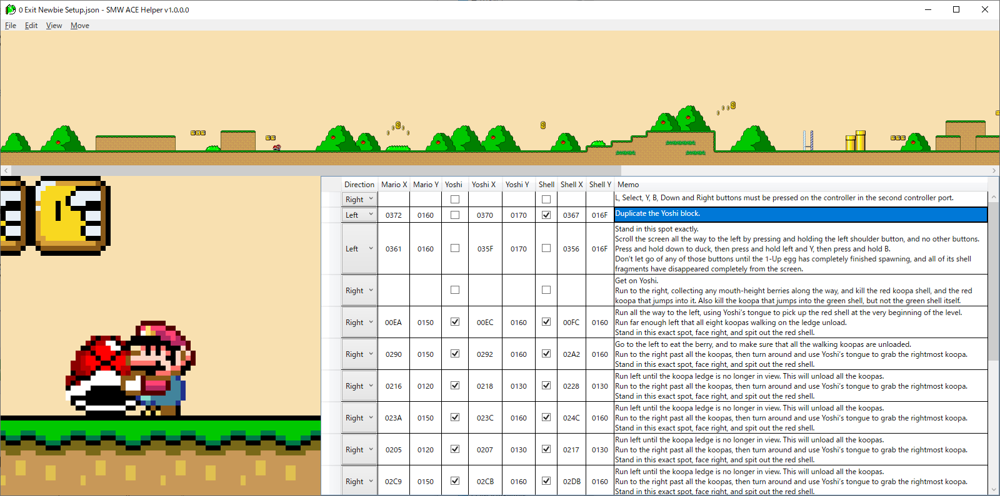

[日本語版 README はこちら](README-ja.md)

# SMW ACE Helper

SMW ACE Helper is a tool that clearly displays the position of spitting fires and kicking shells to execute arbitrary code in "Yoshi's Island 2" of Super Mario World.

Traditionally, it has been a time-consuming task to find out the location where Yoshi spits fires or Mario kicks shells by taking screenshots and putting the screenshots together in a Google document, but by setting up a strategy in this tool, Mario can be displayed at the set coordinates.

I believe that playing while looking at the screen of this tool is like playing while looking at a screenshot of a Google Docs and it is not counted as cheating.

## Operating Environment

I have tested only on Windows 10 (64bit), but it may work on Windows 7 or later.

If .NET 6.0 Desktop Runtime is not installed, please download and install it from 
https://dotnet.microsoft.com/en-us/download/dotnet/6.0/runtime

## How to Use

Installation of SMW ACE Helper itself is not required.
Extract the file to an appropriate folder and run SmwAceHelper.exe.

Click "File" > "Open" and open "0 Exit Newbie Setup.json" in the Sample folder.
The strategy will be displayed in the table in the bottom right of the screen.
Click one of the cells in the bottom right of the screen and Mario will appear in the bottom left of the screen.

### How to Create Your Strategy

Click "File" > "New" to clear the table in the bottom right of the screen.

Enter Mario's direction, coordinates, whether he rides on Yoshi or not, whether he has a shell or not, and a note in the table at the bottom right of the screen. 
(When you enter one of the coordinates of Mario, Yoshi, or the shell, the other coordinates will be automatically calculated.)

If the Yoshi checkbox is OFF, the coordinates of the shell will be the coordinates when Mario is holding it. 
If the Yoshi checkbox is ON, the coordinates of the shell will be the coordinates when the Yoshi spits fire.

Drag a row header (the leftmost portion of each row) to move the row. 
Hold down the Ctrl key while dragging a row header to copy the row.

In the memo field, you can insert a new line by pressing the Enter key with the Shift key.

### Menu

|Main items|Subitems      |Description                                                                                                 |
|----------|--------------|------------------------------------------------------------------------------------------------------------|
|File      |New           |Clear the table at the bottom right of the screen and create a new strategy.                                |
|          |Open          |Open a file.                                                                                                |
|          |Recent Files  |Open a recently used file.                                                                                  |
|          |Save          |Overwrites the open file.                                                                                   |
|          |Save As       |Name and save the file.                                                                                     |
|          |Exit          |Exit SMW ACE Helper.                                                                                        |
|Edit      |Undo          |Cancel the changes in the table at the bottom right of the screen.                                          |
|          |Redo          |The canceled change is re-applied.                                                                          |
|          |Copy          |Copies the contents of the selected cell or row.                                                            |
|          |Paste         |Pastes the copied contents into the selected cell or row.                                                   |
|          |Insert new row|Inserts a new row.                                                                                          |
|          |Delete        |Delete selected cell or row.                                                                                |
|View      |Thumbnail View|Select the scale for the thumbnail view at the top of the screen.                                           |
|          |Zoom View     |Select the scale for the zoom view at the bottom left of the screen.                                        |
|          |Language      |Select the display language.                                                                                |
|Move      |              |Adjusts the position of Mario for the currently selected row in the table at the bottom right of the screen.|

Thumbnail and zoom views can also be scaled by moving the cursor over each image and holding down the Ctrl key while scrolling the wheel.
